# 🏠 Project: Smart Home "Local-First" Ecosystem

**Author:** Ioan Motrescu
**Type:** Bachelor's Thesis Project (Licență)
**Status:** In Development (Core architecture & Security logic implemented)

## 📖 Overview

This project represents a robust, **Local-First Smart Home platform** designed to bridge the gap between commercial solutions (easy to use but cloud-dependent) and enthusiast open-source systems (secure but complex).

The primary goal is to provide a fully offline-capable ecosystem that runs on a user's local network, ensuring **zero-latency control**, **data privacy**, and—most importantly—an **advanced, granular permission system** tailored for multi-generational families. It solves the common problem: *"How do I let my child control their room's light without giving them access to the central heating configuration?"*

## 🚀 Key Features

### 1. Granular Security & Permissions (RBAC)
Unlike typical "Admin vs. User" apps, this system implements a hierarchical permission matrix:
*   **Hierarchy:** Permissions cascade from **House** → **Room** → **Device**.
*   **Granular Exceptions:** An Admin can grant a user access to a specific Room, but strictly **block** a critical device within it.
*   **Roles:** Distinct capabilities for `Admin` (Manage Structure), `Control` (Operate Devices), and `View` (Read-only monitoring).

### 2. Local-First & Cloud Independence
*   **Offline Operation:** The entire logic resides on a local Node.js server. The house remains smart even when the internet connection is down.
*   **Data Privacy:** Sensor history and usage patterns are stored locally in PostgreSQL, not on third-party servers.

### 3. IoT Auto-Discovery & Onboarding
*   **MQTT Standard:** Implements the **Home Assistant MQTT Discovery** protocol.
*   **Plug & Play:** New devices (ESP32, Tasmota, etc.) are automatically detected by the server and placed in an "Inbox" (Unassigned) area, waiting for the Admin to assign them to a room.

### 4. Intelligent Notification Engine
*   **Event-Driven:** A dedicated backend engine monitors sensor streams in real-time.
*   **Safety First:** Automatic rule generation for critical devices (Smoke, Gas, Flood).
*   **Anti-Spam:** Implemented "Cooldown" logic to prevent notification flooding during persistent alarm states.

### 5. Advanced Video Surveillance
*   **ONVIF Integration:** Compatible with standard IP Cameras.
*   **Low Latency Streaming:** Uses a Dockerized microservice (`RTSPtoWebRTC`) to convert camera streams into WebRTC for instant playback on mobile devices.

## 🛠️ Technology Stack

The project utilizes a modern, type-safe stack organized in a modular monolith architecture.

*   **Mobile Client:**
    *   **Framework:** React Native (Expo SDK)
    *   **Language:** TypeScript
    *   **UI/UX:** NativeWind (Tailwind CSS), Custom Design System
    *   **State:** Zustand (for optimistic UI updates)
*   **Local Server (The Brain):**
    *   **Runtime:** Node.js
    *   **API:** Express.js (REST)
    *   **Database:** PostgreSQL (using JSONB for flexible sensor data)
    *   **Communication:** MQTT (Eclipse Mosquitto Broker) via TLS
    *   **Security:** Session-based Authentication (HTTP-Only Cookies), Bcrypt hashing
*   **Infrastructure:**
    *   **Docker:** Containerization of the Database, MQTT Broker, and Video Streaming Service.

## 📱 User Experience (UX)

The mobile interface is designed to be "Context-Aware." The application adapts its layout based on the logged-in user's role:
*   **Admins** see configuration buttons (Edit, Delete, Invite User).
*   **Regular Users** see control interfaces (Switches, Sliders).
*   **Restricted Users (View-Only)** see the device status, but interaction elements are visually disabled to indicate lack of permission.

## 📸 Interface Gallery

  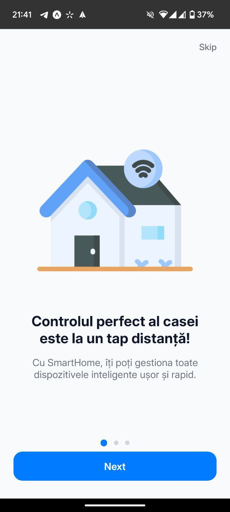
  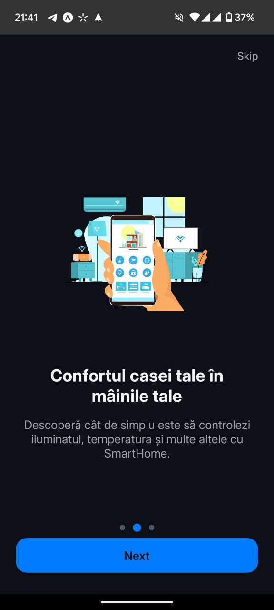

  
  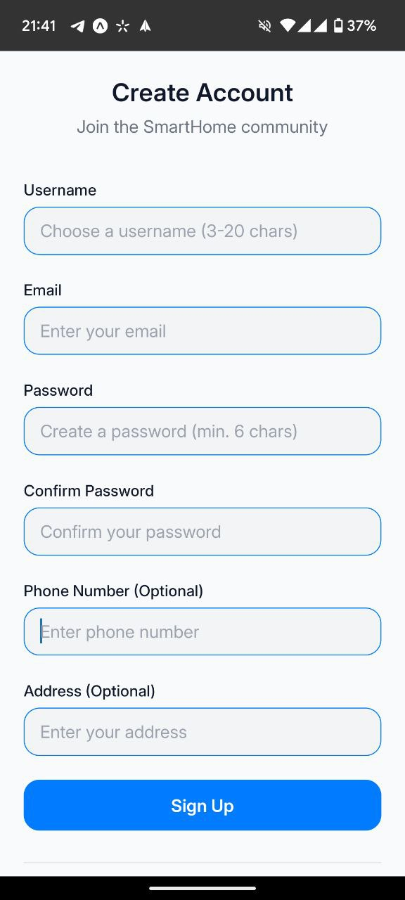

  
  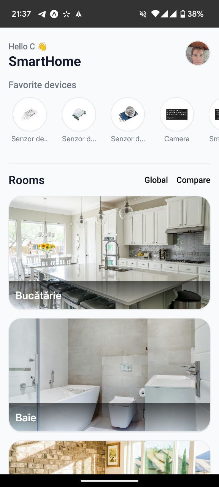

  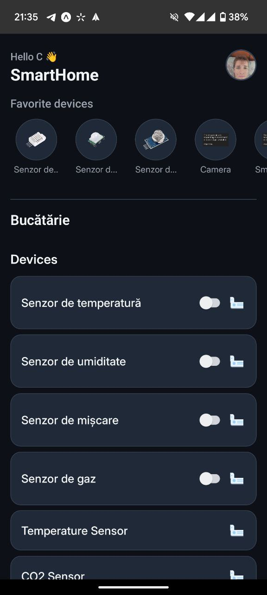
  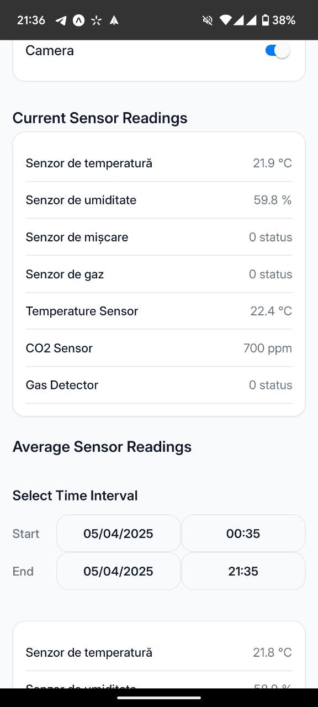

  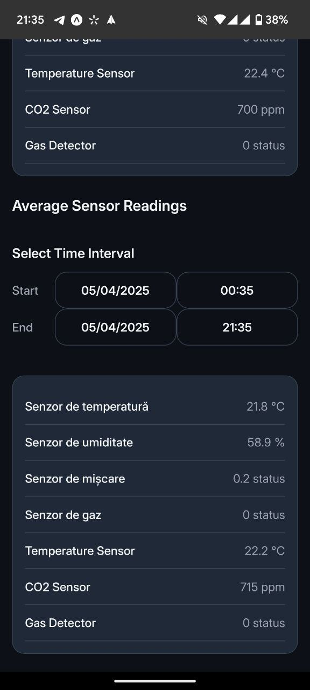
  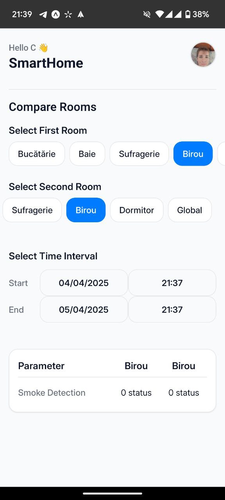

  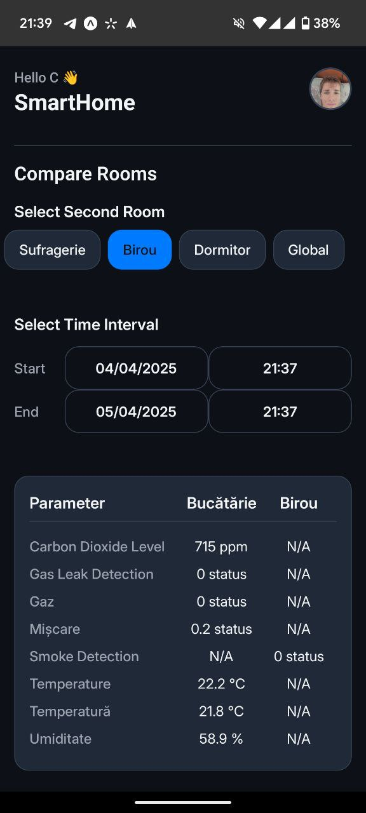
  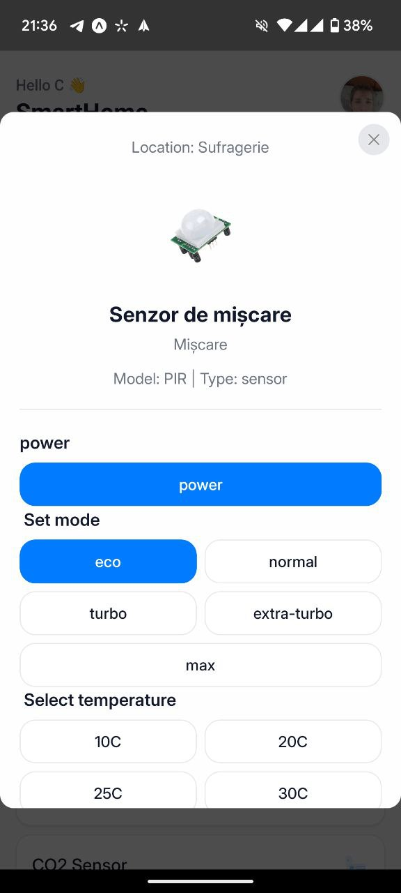

  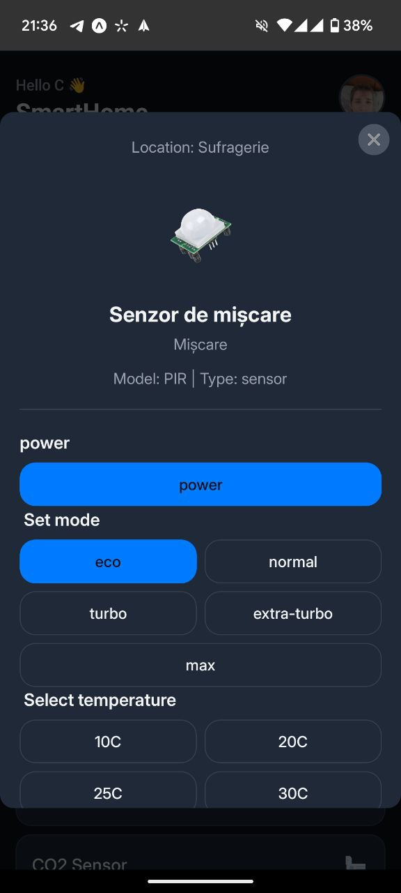
  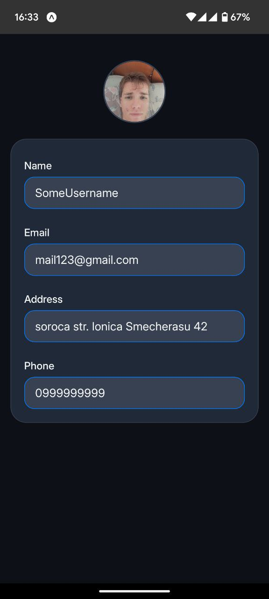

  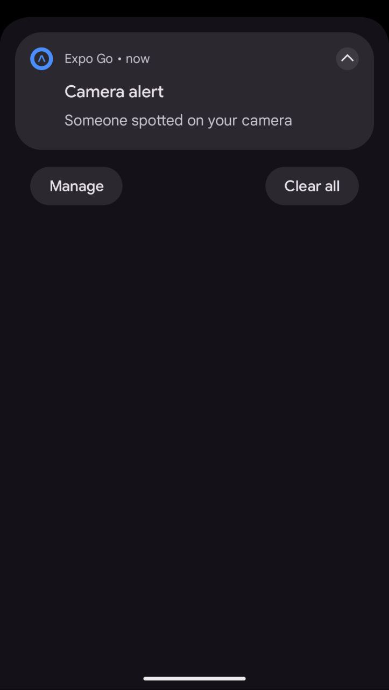
  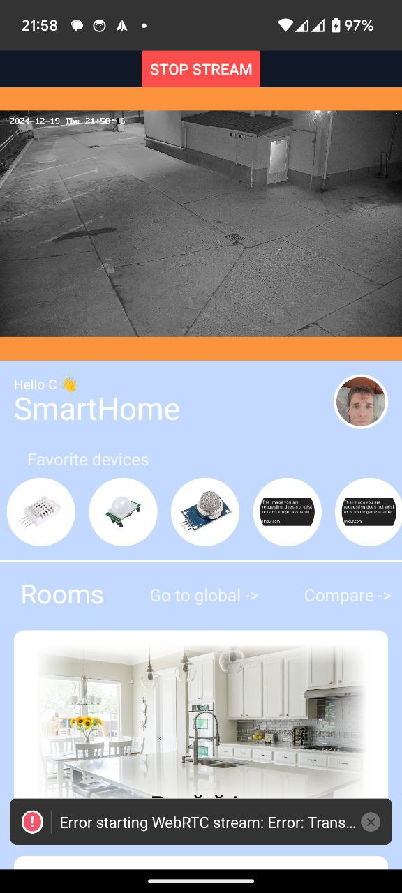

